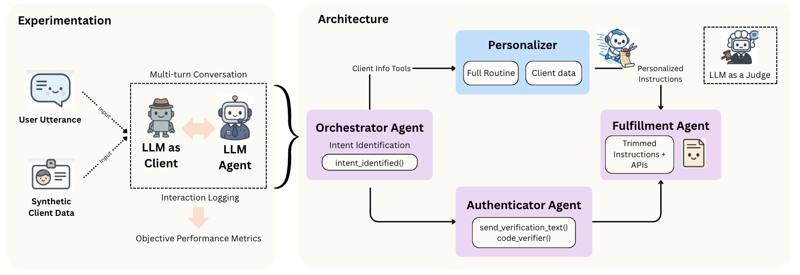

[](https://mas-2025.github.io/MAS-2025/)
[](LICENSE)


# Agent WARPP: Workflow Adherence via Runtime Parallel Personalization 

<p align="center">
  
</p>

## Overview

This repository contains the code and data for our paper, accepted at the 2025 ICML Workshop on Multi-Agent Systems in the Era of Foundation Models. Here is the link to the paper: https://www.arxiv.org/abs/2507.19543. We introduce a **Personalization Agent** that dynamically customizes workflows and tool selection for each user, prior to fulfillment, enabling adaptive and context-aware automation across multiple domains.


## Architecture

<p align="center">
  
</p>

The system consists of:
- **Orchestrator Agent:** Initiates the dialogue, identifies intent, and launches personalization and authentication processes in parallel.
- **Authenticator Agent:** Verifies user identity before sensitive actions, simulating 2FA.
- **Personalization Agent:** Runs concurrently to adapt workflows and tools based on user context and pre-filled information.
- **Fulfillment Agent:** Executes the final personalized workflow with the appropriate reduced tool set.


## Getting Started

### Requirements

- Python 3.8+
- OpenAI API key (needed for Client LLM)
- All dependencies in `requirements.txt`

### Installation

```bash
git clone https://github.com/emiliamazzo/WARPP.git
cd agent_personalization
pip install -r requirements.txt
export OPENAI_API_KEY="your_openai_key"
```

### Data Generation (Optional)

Data generation is not required to replicate the experiments in the paper.  
If you are interested in how user data was generated, see the scripts in `create_data/` and the instructions in the code.

## Supported Models

This codebase was tested on three foundation models, each accessed via a different provider:

- **OpenAI GPT-4o**  
  `--model="openrouter/openai/gpt-4o"`
- **Meta Llama-3 70B Instruct**  
  `--model="openrouter/meta-llama/llama-3-70b-instruct"`
- **Anthropic Claude 3.5 Sonnet**  
  `--model="anthropic/claude-3-5-sonnet-20240620"`

## Running Experiments

### 1. WARPP (Parallelized) & Non-Parallelized Multi-Agent

Run from the project root using `app.py`. Use the `--parallelization` flag to enable runtime personalization.

```bash
# With Runtime Personalization (WARPP)
python app.py \
  --domains=flights \
  --intent=book_flight \
  --parallelization \
  --prompt=Basic \
  --model="chosen_model" \
  --api_key="your_api_key"

# Without Parallelization
python app.py \
  --domains=flights \
  --intent=book_flight \
  --prompt=Basic \
  --model="chosen_model" \ 
  --api_key="your_api_key"
```

> **Note:** You must pass `--api_key` directly when running `app.py`.

---

### 2. ReAct Baseline

Run the ReAct agent from the `react/` directory:

```bash
cd react
python react_agent.py \
  --domains=hospital \
  --intent=process_payment \
  --model="chosen_model" \ 
  --api_key="your_api_key"
```

> **Note:** You must also provide `--api_key`.

---

### 3. Batch Experiments

Run multiple experiments at once using `run_experiments.py`. You must set API keys as environment variables:

```bash
export OPENROUTER_KEY="your_openrouter_api_key"
export ANTHROPIC_API_KEY="your_anthropic_api_key"

python run_experiments.py
```

---


## Evaluation Workflow

To reproduce the evaluation in the paper:
```bash
cd evaluation
```

1. **Sync dynamic results**  
   Extracts tool calls and outputs from generated trajectories and stores them in user data.  
   ``` 
   python sync_dynamic_results.py
   ```

2. **Collect evaluation data**  
   Combines all customer data, generated trajectories, and ground truth trajectories by experiment.
   ```bash
   python data_collector.py
   ```

3. **Run evaluation**  
   Performs evaluation and generates CSV files.
   ```bash
   python run.py
   ```

4. **Usage results**  
   Generates additional results on token usage.
   ```bash
   python analyzer.py
   ```

## Directory Structure

```
agent_personalization/
├── app.py
├── run_experiments.py
├── models.py
├── utils.py
├── llm_utils.py
├── requirements.txt
├── LICENSE
├── README.md
├── agent_setup/
│   ├── __init__.py
│   ├── instructions.py
│   └── setup.py
├── client_llm/
│   ├── __init__.py
│   ├── client_llm_utils.py
│   └── instructions.py
├── create_data/
│   ├── complex.py
│   ├── data_creation.py
│   ├── get_required_fields.py
│   ├── intermediate.py
│   ├── simple.py
│   └── first_utterance/
│       ├── generator.py
│       ├── output/
│       ├── prompt.py
│       └── update_json_file.py
├── evaluation/
│   ├── analyzer.py
│   ├── data_collector.py
│   ├── evaluation_data.json
│   ├── metrics.py
│   ├── run.py
│   ├── sync_dynamic_results.py
│   ├── test_utils_and_metrics.py
│   ├── utils.py
│   └── output/
│       ├── all_sequences_comparison.csv
│       ├── evaluation_differences.csv
│       ├── evaluation_intent_model_experiment_level.csv
│       ├── evaluation_intent_experiment_level.csv
│       ├── evaluation_intent_model_level.csv
│       ├── evaluation_client_level.csv
│       ├── evaluation_experiment_level.csv
│       ├── evaluation_model_experiment_level.csv
│       ├── usage_data.csv
│       └── aggregated_usage_data.csv
├── llm_as_judge/
│   ├── evaluate_scores_by_model_domain.py
│   ├── instructions.py
│   ├── judge_run.py
│   ├── test_data_loading.py
│   └── utils.py
├── output/
│   ├── dynamic_results/
│   ├── ground_truth_trajectory/
│   ├── judge_trimmed_routine/
│   ├── trajectory/
│   ├── trimmed_routines/
│   └── usage/
├── react/
│   ├── config.py
│   ├── example.py
│   ├── react_agent.py
│   └── react_utils.py
├── static/
│   ├── architecture_graph.png
│   └── icon.png
├── test_data/
│   ├── authenticator_workflow.json
│   ├── ComplexHospital/
│   ├── customer_data/
│   ├── IntermediateFlights/
│   ├── orchestrator_workflow.json
│   └── SimpleBanking/
├── tracing/
│   ├── __init__.py
│   └── setup.py
```

## Supported Domains and Intents

| Domain    | Intents                        |
|-----------|-------------------------------|
| Banking   | update_address, withdraw_retirement_funds |
| Flights   | book_flight, cancel_flight    |
| Hospital  | process_payment               |

## Key Output Files

All key output files are in `evaluation/output/`, including:
- CSV files with per-intent and overall metrics
- JSON files with detailed trajectories and results
- Token usage and resource statistics

## License

MIT License. See [LICENSE](LICENSE).


## Contact
Email us at <emilia_mazzolenis@vanguard.com> or <ruirui_zhang@vanguard.com> for general inquiries or collaborations.